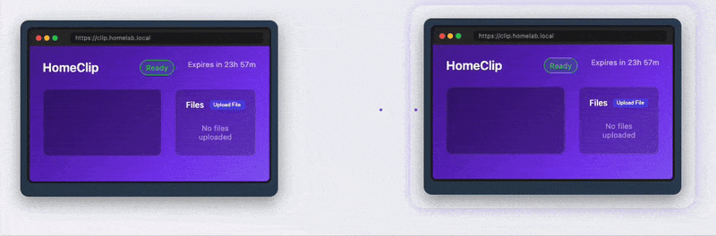

# HomeClip - Your Household Clipboard

**The shared clipboard for your entire home network**



HomeClip is a self-hosted clipboard manager designed for homelab enthusiasts who want a simple, secure way to share text
and files between all devices on their home network. Think of it as a household bulletin board where family members can
quickly share notes, URLs, codes, or files that automatically clean themselves up after 24 hours.

## Perfect for Homelabs

Designed specifically for homelab environments where you need to:

- Share text between devices without cloud services
- Quickly transfer files across your home network
- Paste snippets from your phone to your main PC
- Share URLs between family members' devices
- Keep sensitive data within your own network

## Features

- **Shared Text Editor**: Clean, simple interface accessible from any device on your network
- **File Attachments**: Upload and share files between devices
- **Auto-expiration**: Content automatically expires after 24 hours for privacy (configurable)
- **Local Network First**: Designed to run on your home server, NAS, or Raspberry Pi
- **Private by Design**: No external dependencies, everything stays in your home
- **Docker Ready**: One-command deployment with Docker
- **Mobile Friendly**: Responsive design works on phones, tablets, and desktops
- **Lightweight**: Minimal resource usage, perfect for small homelab servers

## Quick Start

### Using Docker (Recommended for Homelab)

```bash
# Run on your home server, NAS, or Raspberry Pi
docker run -d \
  --name homeclip \
  --restart unless-stopped \
  -p 8080:8080 \
  -e ENABLE_FILE_UPLOADS=true \
  -e MAX_FILE_SIZE=52428800 \
  ghcr.io/d6o/homeclip:latest

# Access from any device on your network at:
# http://your-server-ip:8080
```

### Using Docker Compose (Perfect for Homelab Stacks)

Add to your existing homelab docker-compose.yml:

```yaml
services:
  homeclip:
    image: ghcr.io/d6o/homeclip:latest
    container_name: homeclip
    ports:
      - "8080:8080"  # Change port if needed
    environment:
      - PORT=8080
      - ENABLE_FILE_UPLOADS=true
      - MAX_FILE_SIZE=52428800
      - CLEANUP_INTERVAL=5m
      - EXPIRATION_DURATION=24h
    restart: unless-stopped

```

## Configuration for Homelab

Environment variables tailored for home network use:

| Variable              | Default    | Homelab Recommendation | Description                         |
|-----------------------|------------|------------------------|-------------------------------------|
| `PORT`                | `8080`     | `8080`                 | Port for web interface              |
| `ENABLE_FILE_UPLOADS` | `true`     | `true`                 | Enable file sharing between devices |
| `MAX_FILE_SIZE`       | `10485760` | `104857600`            | 100MB - good for most home uses     |
| `MAX_CONTENT_SIZE`    | `1048576`  | `10485760`             | 10MB text - plenty for code/configs |
| `CLEANUP_INTERVAL`    | `5m`       | `5m`                   | How often to clean expired content  |
| `EXPIRATION_DURATION` | `24h`      | `24h`                  | How long content stays active       |
| `READ_TIMEOUT`        | `15s`      | `30s`                  | Increase for slower home networks   |
| `WRITE_TIMEOUT`       | `15s`      | `30s`                  | Increase for large file uploads     |
| `IDLE_TIMEOUT`        | `60s`      | `120s`                 | Keep connections open longer        |

## Homelab Use Cases

### Common Scenarios

1. **Cross-Device Copy/Paste**
    - Copy a URL on your desktop, paste on your phone
    - Share WiFi passwords with guests
    - Transfer API keys between development machines

2. **Family Sharing**
    - Shopping lists that auto-expire
    - Daily schedules or reminders
    - Quick notes between family members

3. **Homelab Administration**
    - Share configuration snippets
    - Transfer Docker commands between machines
    - Temporary storage for backup codes
    - Share SSH keys between machines

4. **Media Server Integration**
    - Share Plex/Jellyfin invite links
    - Transfer subtitle files
    - Quick sharing of media server URLs

## Usage

1. **Open HomeClip** from any device on your network
2. **Type or paste** content into the editor
3. **Upload files** by dragging and dropping (if enabled)
4. **Share the link** or just access from another device
5. **Content expires** automatically after 24 hours

## API Endpoints

Integrate with other homelab services:

### Content Management

- `GET /api/content` - Get current content
- `POST /api/content` - Update content

### File Management

- `POST /api/files/upload` - Upload file
- `GET /api/files` - List files
- `GET /api/files/{id}` - Download file
- `DELETE /api/files/{id}` - Delete file

### Health Checks

- `GET /api/health` - Health check
- `GET /api/ready` - Readiness check

## Homelab Integration

### Nginx Proxy Manager

Add a new proxy host:

- Domain: `clip.home.local`
- Forward IP: `192.168.1.100` (your server IP)
- Forward Port: `8080`

### Homepage Dashboard

```yaml
# Add to services.yaml
- HomeClip:
    icon: clipboard
    href: http://192.168.1.100:8080
    description: Household Clipboard
    widget:
      type: customapi
      url: http://192.168.1.100:8080/api/health
```

### Home Assistant Integration

```yaml
# Add to configuration.yaml

# Send text to HomeClip
rest_command:
  send_to_homeclip:
    url: "http://192.168.1.100:8080/api/content"
    method: POST
    headers:
      Content-Type: "application/json"
    payload: '{"content": "{{ message }}"}'

# Read HomeClip content
sensor:
  - platform: rest
    name: "HomeClip Content"
    resource: http://192.168.1.100:8080/api/content
    value_template: "{{ value_json.content }}"
    scan_interval: 60
```

## Architecture

Built with homelab reliability in mind:

- **No Database Required**: Uses in-memory storage - perfect for temporary sharing
- **Single Binary**: Compiles to one executable, easy to deploy anywhere
- **Minimal Dependencies**: Just Go and Docker, no complex setup
- **Resource Efficient**: Runs comfortably on a Raspberry Pi
- **Network Isolated**: Designed to work without internet access

### Resource Requirements

**Minimum (Raspberry Pi):**

- CPU: 100m
- Memory: 128Mi

**Recommended (Home Server):**

- CPU: 500m
- Memory: 512Mi

## Development

### Prerequisites

- Go 1.24.6+
- Docker
- Make

### Building

```bash
make build
```

### Running Tests

```bash
make test
```

### Local Development

```bash
make run
```

## Community

HomeClip is built by and for the homelab community. Share your setups, integrations, and ideas!

- Report issues: [GitHub Issues](https://github.com/d6o/homeclip/issues)
- Share your homelab setup: [Discussions](https://github.com/d6o/homeclip/discussions)
- Contribute: PRs welcome!

## License

MIT

---

**Made with ❤️ for the Homelab Community**

*Remember: Your clipboard, your network, your data!*
